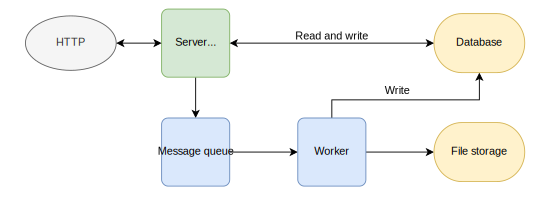

# Shrinker

Shrinker is a web api using a message queue in order to offload heavy computing tasks (namely image processing) to a worker.

## Getting started

### Prerequisite for the first start

First, a .env file must be provided at the root directory.
For a quick start you can use the values from provided example.

```sh
echo "$(cat .env.example)" >> .env
```

A mysql docker instance must be running:

```sh
make docker
```

Once the instance is ready, run the executable with `-m` flag to perform mock migrations:

```sh
go run cmd/server/main.go -m
```

### Run the project

```sh
# api server
# alias to make docker && go run cmd/server/main.go
make start

# static server
go run cmd/static/*.go

# worker
go run ./cmd/worker/main.go
```

## Infrastructure



## Control flow

Request to the API to upload an avatar:

```txt
POST /api/v1/users/{id}/avatar

content:
<file>
{"user_id": 1}
```


## Project structure

The main functional packages are structured this way:

```txt
.
├── cmd
│   ├── server
│   └── worker
├── internal
│   ├── database
│   ├── http
│   └── storage
└── pkg
    ├── queue
    └── image
```

`internal` package holds the definitions of the business entities at its root.
