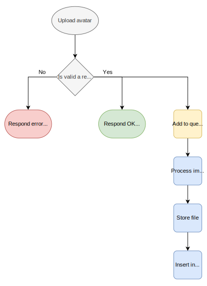

# Shrinker <!-- omit in toc -->

Shrinker is an application that uses a message broker to offload image processing tasks from a web API to a dedicated worker.

Authenticated users can make request to the API server to upload image file as their avatar. The images are resized to a smaller scale and saved to a file storage to be viewable by anyone.

We currently support images uploaded in `.png` or `.jpeg` format.

## Table of contents <!-- omit in toc -->

- [Getting started](#getting-started)
  - [Installing dependencies](#installing-dependencies)
  - [Set up](#set-up)
  - [Run the project](#run-the-project)
  - [Call the endpoints for quick testing](#call-the-endpoints-for-quick-testing)
- [Infrastructure](#infrastructure)
  - [The API server](#the-api-server)
  - [The message broker](#the-message-broker)
  - [The worker](#the-worker)
- [Control flow](#control-flow)
- [Architecture](#architecture)
  - [Folder structure](#folder-structure)
  - [`internal`](#internal)
  - [`pkg`](#pkg)
  - [`cmd`](#cmd)
  - [Miscellaneous](#miscellaneous)
- [Further documentation](#further-documentation)
- [Acknowledgement and contributors](#acknowledgement-and-contributors)

## Getting started

### Installing dependencies

```sh
go get -u
```

> Note: Go version 1.16 minimum is required.

### Set up

> Note: you must be able to run Docker and Docker Compose on your local machine to run this app. Refer to the [Get Docker](https://docs.docker.com/get-docker/) and [Install Docker Compose](https://docs.docker.com/compose/install/) docs for their installation.

You must provide a `.env` file inside the root directory.
For a quick start, you can use the values from the provided example:

```sh
echo "$(cat .env.example)" >> .env
```

Set up and run the MySQL docker instance:

```sh
make docker
```

The storage server expects to store and serve images from `./storage`. You must create this folder, from the root run:

```sh
mkdir storage
```

### Run the project

This project uses 3 executables and one instance of a message queue. You need to run them all at the same time.

#### Message queue <!-- omit in toc -->

The message queue must be up and running before anything else.

```sh
docker run -it --rm --name rabbitmq -p 5672:5672 -p 15672:15672 rabbitmq:3-management
```

#### API server <!-- omit in toc -->

```sh
make start-server
```

#### Static file server <!-- omit in toc -->

```sh
make start-storage
```

#### Worker <!-- omit in toc -->

```sh
make start-worker
```

### Call the endpoints for quick testing

In order to showcase the main point of this project, we provide 2 handy scripts in the [Makefile](/Makefile) for quick tests.

These scripts are only concerned with login you in and making an upload request as that user. They are written to work with our dummy user _Bret_.

```sh
make login
# {"access_token": "<your_token>"}

t=<your_token> make post-avatar
# 202 Accepted
```

You can now get the updated user and open in your browser the URL to see the processed image.

```sh
curl http://localhost:9999/users/1
# {
#   "id":1,
#   "username":"Bret",
#   "email":"Sincere@april.biz",
#   "avatar_url":"http://localhost:9998/storage/9f31c631-a868-4727-94f5-ccd30f0e3db7.png"
# }
```

## Infrastructure

We aim to mimic what a cloud based infrastructure would be, to minimize the overhead of swapping to such a deployment strategy later.


Each of the 5 entites above runs in a docker container.

The 3 main applicative entities are the **API server**, the **worker** and the **message broker**.

### The API server

The API simply answers to client requests and interacts with the database and the message broker when resquests call for it.

### The message broker

The message broker is in charge of forwarding API messages to the worker for it to start its job.

It uses RabbitMQ.

### The worker

The worker runs its job then makes resquests to store files and can write in the database.

It leverages two customs modules, `queue` package built ontop of [streadway/amqp](https://github.com/streadway/amqp) and `imaging` which wraps [disintegration/imaging](https://github.com/disintegration/imaging) for image processing.

## Control flow

The main work flow of this project is the request for a user to upload an avatar.

```txt
POST /api/v1/users/{ID}/avatar

content type: multipart/form-data
body: <image_file>
```



## Architecture

### Folder structure

The main functional packages for the project are:

```txt
.
├── cmd
│   ├── server
│   ├── storage
│   └── worker
├── internal
│   ├── database
│   └── http
└── pkg
    ├── queue
    └── image
```

### `internal`

The main application code, it can be viewed as private. Domain related type definitions are at its root and packages within are grouped by dependencies (database, http, etc.).

### `pkg`

Reusable library code. It is safe to use by external applications. It does not import any types from `internal` and does not rely on it to work. There is no domain logic inside this directory.

### `cmd`

Main applications for the project. Children direcories are each equivalent to one executable and are independant from one another. A `main` function may need to import and call code from `internal` or `pkg`. If so, it will ties all dependencies together.

### Miscellaneous

Other directories are self explanatory.

## Further documentation

Sub-packages have their own documentation when it is relevant. You may refer to these docs for further explanation: Notably:

- [http](internal/http/README.md) (comes with handy curl commands)
- [database](internal/database/README.md)
- [queue](pkg/queue/README.md)
- [storage](cmd/storage/README.md)
- [worker](cmd/worker/README.md)

## Acknowledgement and contributors

This project is part of an school assignement. Our team members are:

- Gregory Albouy
- Thomas Moreira
